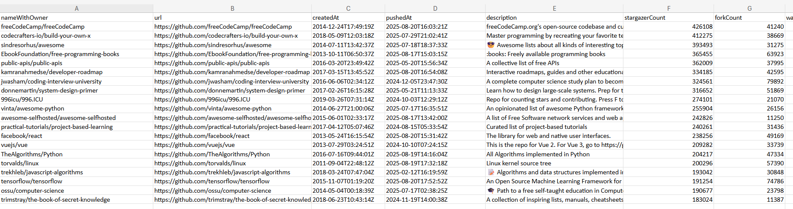

# GitHub Repo Fetch
---

## Descrição

O **GitHub Repo Fetch** é uma ferramenta em Python que coleta informações detalhadas de repositórios públicos do GitHub usando a API GraphQL. Os dados são salvos em **CSV** e **JSON**, permitindo análises, relatórios e integração com outras ferramentas.

O projeto é útil para:

- Análise de métricas de repositórios
- Monitoramento de projetos open-source
- Criação de dashboards e relatórios automáticos
- Estudos de popularidade de linguagens, tópicos e licenças

---

## Funcionalidades

- Busca repositórios públicos em lotes configuráveis
- Coleta dados detalhados:
  - Nome do repositório e URL
  - Datas de criação e último push
  - Descrição
  - Estrelas, forks, watchers
  - Issues abertas e fechadas
  - Pull requests abertas, fechadas e mescladas
  - Contagem de releases
  - Linguagem principal
  - Uso de disco
  - Licença (nome e SPDX)
  - Tópicos associados
- Gera arquivos:
  - `CSV` (excel-friendly)
  - `JSON` (para manipulação programática)
- Tratamento automático de campos ausentes (evita erros `NoneType`)

---

## Estrutura do Projeto

```
github-repo-fetch/
├── data/                  # Arquivos gerados (CSV e JSON)
├── src/
│   └── save_data.py       # Funções para salvar CSV e JSON
├── main.py                # Script principal de execução
└── README.md
```

---

## Requisitos

- **Python 3.10+**
- Bibliotecas Python:
  ```bash
  pip install requests python-dotenv
  ```
- **GitHub Personal Access Token** com permissão de leitura de repositórios públicos

---

## Configuração

1. Crie um arquivo `.env` na raiz do projeto:
   ```
   GITHUB_TOKEN=seu_token_aqui
   ```

2. Certifique-se de que a pasta `data/` existe. O script também pode criá-la automaticamente.

3. Configure o número de repositórios por lote no `main.py` (padrão: 10 por vez).

---

## Como Executar

No terminal, execute:

```bash
python main.py
```

O script buscará repositórios e salvará os dados em:

- `data/repositories.csv`
- `data/repositories.json`

---

## CSV compatível com Excel

- Usa **ponto e vírgula `;` como separador**, garantindo que campos com vírgulas não quebrem colunas
- Todos os campos de texto estão entre aspas
- Codificação **UTF-8 com BOM (`utf-8-sig`)**, garantindo compatibilidade com acentos no Excel

### Exemplo de CSV



---

## JSON

- Formato estruturado, fácil de usar em scripts, dashboards e APIs
- Mantém toda a hierarquia de dados do GitHub GraphQL

---

## Boas Práticas

- Sempre utilize seu **token de forma segura**, nunca publique em repositórios públicos
- Para grandes volumes, aumente ou diminua o lote de repositórios por busca conforme a capacidade da API
- Se algum campo estiver ausente, o script preenche automaticamente como vazio, evitando falhas

