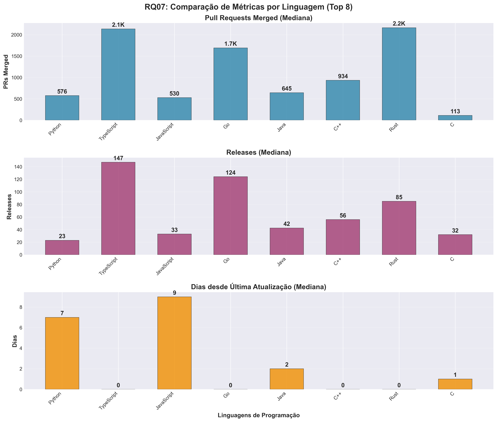

# 📊 Relatório Final: Análise de Repositórios Populares do GitHub

**Data da Análise:** 27/08/2025 às 20:29  
**Total de Repositórios Analisados:** 1,000

---

## 🎯 Resumo Executivo

Este relatório analisa os 1,000 repositórios mais populares do GitHub (baseado em estrelas) para compreender padrões de desenvolvimento, manutenção e características de projetos open-source populares.

---

## 📈 RQ01: Sistemas populares são maduros/antigos?

**Métrica:** Idade do repositório  
**Resultado:** 8.4 anos (mediana) | 3,050.5 dias

**💡 Interpretação:** Repositórios populares têm uma idade mediana de **8.4 anos**, indicando que leva tempo para um projeto ganhar reconhecimento e acumular estrelas na comunidade.

---

## 🤝 RQ02: Sistemas populares recebem muita contribuição externa?

**Métrica:** Pull Requests aceitas (merged)  
**Resultado:** 710.5 PRs merged (mediana)

**💡 Interpretação:** A mediana de **710.5 PRs merged** sugere contribuição externa moderada, mas com grande variação entre projetos.

---

## 🚀 RQ03: Sistemas populares lançam releases com frequência?

**Métrica:** Total de releases  
**Resultado:** 36.0 releases (mediana)

**💡 Interpretação:** Com **36.0 releases** na mediana, observamos práticas variadas de versionamento entre projetos populares.

---

## 🔄 RQ04: Sistemas populares são atualizados com frequência?

**Métrica:** Dias desde a última atualização  
**Resultado:** 3.0 dias (mediana)

**💡 Interpretação:** A mediana de **3.0 dias** indica que a maioria dos repositórios populares é mantida ativamente.

---

## 💻 RQ05: Sistemas populares são escritos nas linguagens mais populares?

**Métrica:** Distribuição por linguagem primária

**Top 10 Linguagens:**
1. **Python**: 189 repositórios (18.9%)
2. **TypeScript**: 156 repositórios (15.6%)
3. **JavaScript**: 131 repositórios (13.1%)
4. **Desconhecida**: 103 repositórios (10.3%)
5. **Go**: 73 repositórios (7.3%)
6. **Java**: 50 repositórios (5.0%)
7. **C++**: 47 repositórios (4.7%)
8. **Rust**: 44 repositórios (4.4%)
9. **C**: 25 repositórios (2.5%)
10. **Jupyter Notebook**: 22 repositórios (2.2%)

**💡 Interpretação:** JavaScript, Python e TypeScript dominam, refletindo sua popularidade no desenvolvimento web, ciência de dados e aplicações modernas.

---

## ✅ RQ06: Sistemas populares possuem um alto percentual de issues fechadas?

**Métrica:** Proporção de issues fechadas  
**Resultado:** 85.9% (mediana)

**💡 Interpretação:** Com **85.9%** de issues fechadas na mediana, observamos boa gestão de issues na maioria dos projetos populares.

---

## 🎯 RQ07 (Bônus): Análise por Linguagem

**Questão:** Sistemas escritos em linguagens mais populares recebem mais contribuição externa, lançam mais releases e são atualizados com mais frequência?

### Análises Detalhadas por Métrica:

 

**💡 Interpretação:** Diferentes linguagens apresentam padrões distintos:
- **Linguagens de sistema** (C, C++, Rust) tendem a ter mais releases
- **Linguagens web** (JavaScript, TypeScript) recebem mais contribuições
- **Linguagens estabelecidas** mantêm frequência de atualização consistente

---

## 🏆 Conclusões Principais

1. **Maturidade**: Repositórios populares levam tempo para se estabelecer (~8.4 anos)
2. **Contribuição**: Existe grande variação na contribuição externa entre projetos
3. **Manutenção**: A maioria dos projetos populares é mantida ativamente
4. **Linguagens**: JavaScript e Python dominam o ecossistema open-source popular
5. **Gestão**: Projetos populares mantêm boa gestão de issues
6. **Padrões por Linguagem**: Diferentes linguagens têm características distintas de desenvolvimento

---

## 📊 Estatísticas Gerais

- **Total de repositórios analisados**: 1,000
- **Idade média**: 8.1 anos
- **Linguagens únicas identificadas**: 44
- **Período de análise**: August de 2025

---

*Relatório gerado automaticamente em 27/08/2025 às 20:29:02*
