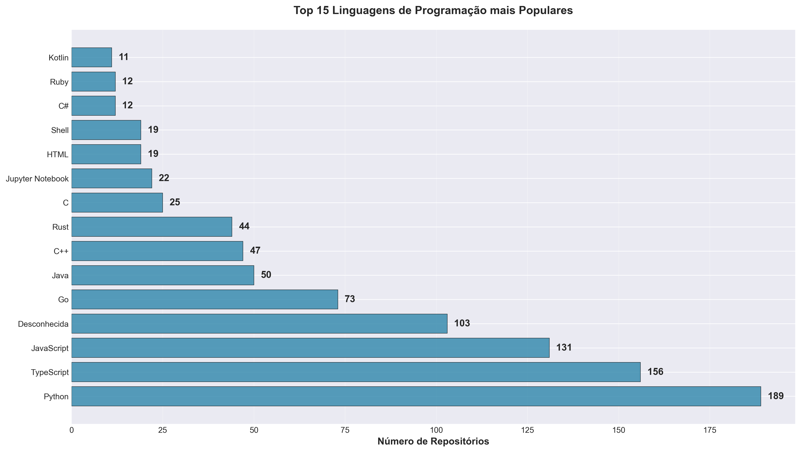
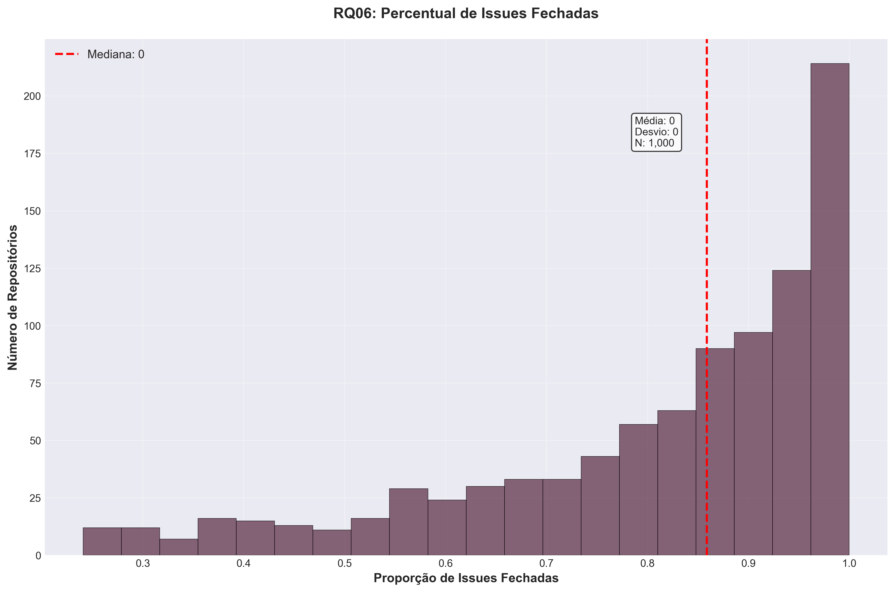
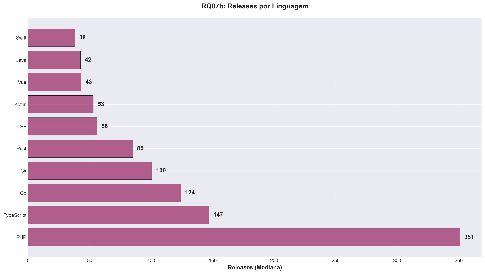

# Relatório dos Repositórios Populares do GitHub

## RQ01: Sistemas populares são maduros/antigos?
- Idade mediana (dias): **3513.5**

## RQ02: Sistemas populares recebem muita contribuição externa?
- Pull requests aceitas medianas: **875.0**

## RQ03: Sistemas populares lançam releases com frequência?
- Releases medianos: **0.0**

## RQ04: Sistemas populares são atualizados com frequência?
- Dias desde última atualização (mediana): **16.5**

## RQ05: Sistemas populares são escritos nas linguagens mais populares?
- Contagem por linguagem (Top 20 exibidas no gráfico):

## RQ06: Sistemas populares possuem um alto percentual de issues fechadas?
- Percentual mediano de issues fechadas: **0.93**

---

## RQ07 (Bônus): Análise por linguagem
- Comparação de PRs, Releases e Atualizações por linguagem:

---

# Hipóteses Informais
1. Repositórios com mais stars tendem a ser mais antigos.
2. Repositórios com mais PRs aceitas são mais populares.
3. Linguagens populares possuem mais repositórios e forks.
4. Repositórios com atualizações recentes estão ativos e mantidos.
5. A maioria das issues é fechada.

# Discussão
(Preencher analisando os gráficos e valores obtidos. Exemplo: confirmamos que a maioria dos repositórios populares tem idade elevada, indicando maturidade.)
